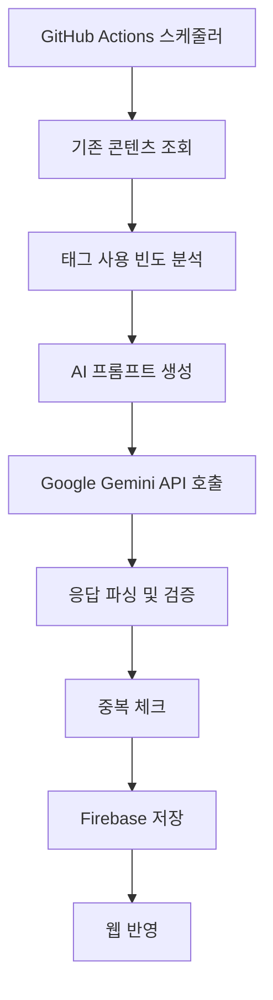

# 🐽 Smelly.dev - 프론트엔드 안티패턴 학습 플랫폼

> **매일 하나씩, 프론트엔드 안티패턴을 AI와 함께 학습하는 웹앱**

> https://smelly-dev.vercel.app/

AI를 이용해서 간단하게 뭘 만들어볼까 고민하다가 탄생한 사이드 프로젝트.
프론트엔드 개발자들을 위한 데일리 웹앱으로 AI 프롬프를 통해 매일 새로운 안티패턴을 소개하며, 문제 원인부터 해결법, 전/후 코드 비교까지 구조화된 아티클을 제공합니다.

## 🎯 소개

### 프로젝트 목표

- **주제**: 프론트엔드 안티패턴을 중심으로 구성
- **AI 기반 콘텐츠 생성**: Google Gemini API를 활용한 프롬포트 기반의 자동화된 콘텐츠 생성
- **아티클 구성**: 문제 원인 → 해결법 → 코드 비교 → 참고 링크 순 구성
- **지속적인 업데이트**: GitHub Actions를 통한 매일 자동 콘텐츠 업데이트

## ✨ 주요 기능

### 📚 콘텐츠 관리

- **데일리 안티패턴**: 매일 새로운 프론트엔드 안티패턴 제공
- **난이도 분류**: 초급/중급/고급으로 난이도 구분
- **태그 시스템**: React, TypeScript, CSS, 성능, 보안 등 카테고리별 분류

### 🤖 AI 자동화

- **자동 콘텐츠 생성**: GitHub Actions를 통해 매일 한국시간 12시에 자동 생성
- **중복 방지**: 기존 콘텐츠 분석을 통한 프롬프트 고도화로 중복 콘텐츠 방지
- **품질 관리**: 태그 사용 빈도 분석을 통한 균형잡힌 콘텐츠 구성
- **실시간 업데이트**: 생성 즉시 Firebase DB에 저장 및 웹앱 반영

## 🛠️ 기술 스택

### Frontend

- **Next.js 14** (App Router)
- **TypeScript**
- **TailwindCSS**
- **Shadcn/ui** - 접근성 중심의 UI 컴포넌트

### Backend & Database

- **Firebase Firestore** - NoSQL 클라우드 데이터베이스
- **Firebase Admin SDK** - 서버 사이드 Firebase 연동

### AI & Automation

- **Google Gemini API** - AI 기반 콘텐츠 생성
- **GitHub Actions** - CI/CD 및 자동화 워크플로우
- **Node.js** - 서버 사이드 스크립팅

### Development & Deployment

- **pnpm** - 패키지 매니저
- **ESLint** - 코드 품질 관리
- **Vercel** - 클라우드 배포 플랫폼

## 🏗️ 아키텍처

```
src/
├── app/                    # Next.js App Router
│   ├── antipatterns/       # 안티패턴 관련 페이지
│   ├── layout.tsx         # 루트 레이아웃
│   └── page.tsx           # 메인 페이지
├── components/            # 재사용 가능한 UI 컴포넌트
│   ├── Antipatterns/     # 안티패턴 관련 컴포넌트
│   ├── Article/          # 아티클 표시 컴포넌트
│   └── Layout/           # 레이아웃 컴포넌트
├── lib/                   # 비즈니스 로직
│   └── antipattern.ts    # 안티패턴 데이터 처리
├── shared/               # 공통 리소스
│   ├── config/          # 설정 파일
│   ├── types/           # TypeScript 타입 정의
│   └── ui/              # 공통 UI 컴포넌트
├── utils/               # 유틸리티 함수
└── widgets/             # 복합 UI 위젯
```

### 데이터 플로우

1. **콘텐츠 생성**: GitHub Actions → Google Gemini API → Firebase Firestore
2. **콘텐츠 조회**: Firebase Admin SDK → 서버사이드 렌더링 → 클라이언트 전달ㅇ
3. **실시간 업데이트**: 자동 생성 → 즉시 웹앱 반영

### AI 기반 자동 콘텐츠 생성 플로우



## 🔮 향후 계획

- [x] 관련된 링크 섹션 업데이트 (25.06.29)
- [x] 다크 모드 지원 (25.07.01)
- [ ] 북마크 기능
- [x] 필터링 (25.06.29)
- [ ] 검색
- [ ] 사용자 인증 시스템
- [ ] 소셜 공유 기능
